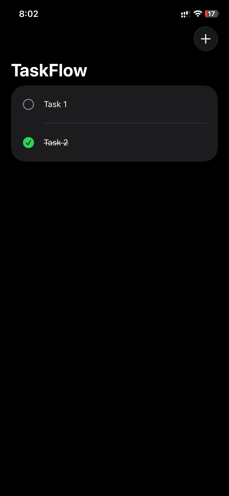

# TaskFlow

A simple task management iOS application built with **SwiftUI** following **Clean Architecture** and **MVVM**.

## Features

- ✅ Add new tasks
- ✅ Delete tasks
- ✅ Mark tasks as completed
- ✅ Dependency Injection
- ✅ Clean Architecture

## Architecture

```
Presentation
    ↓
Domain
    ↓
Data
```

## Tech Stack

- Swift
- SwiftUI
- MVVM
- Clean Architecture

## Screenshot



## Author

Mohamed Ibrahim
